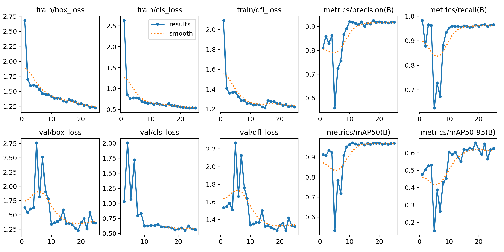

# Deteksi Objek Pohon Kelapa Sawit Menggunakan Model YOLOv8

## Pendahuluan

Proyek ini bertujuan untuk mendeteksi objek Pohon Kelapa dalam gambar/video menggunakan model **YOLOv8**.

### Alasan Menggunakan YOLOv8

YOLO (*You Only Look Once*) adalah keluarga model deteksi objek yang dikenal dengan kecepatan dan akurasinya. Dalam proyek ini, dipilih YOLOv8 karena memiliki beberapa keunggulan berikut:

1. **Performa Tinggi**: YOLOv8 dirancang dengan arsitektur yang lebih efisien, memungkinkan deteksi objek secara real-time dengan akurasi tinggi.
2. **Fleksibilitas**: Model ini mendukung berbagai tugas seperti deteksi objek, segmentasi, dan klasifikasi, yang membuatnya cocok untuk berbagai kebutuhan.
3. **Kemudahan Penggunaan**: YOLOv8 memiliki integrasi yang baik dengan pustaka Python dan mendukung penggunaan API, sehingga mempermudah proses pelatihan dan prediksi.

## Teknologi yang Digunakan

- **Model**: YOLOv8
- **Bahasa Pemrograman**: Python
- **Framework**: Ultralytics YOLO dan library pendukung lainya
- **Lingkungan**: Google Colab / Jupyter Notebook

## Dataset

Dataset yang digunakan dalam proyek ini terdiri dari **413 gambar** pohon kelapa sawit dari ketinggian yang telah diberi label anotasi dengan format untuk model YOLOv8. Untuk proses anotasi atau labeling saya menggunakan platform **Roboflow**. Dataset ini dirancang untuk mendukung deteksi objek yang spesifik, yaitu kelapa sawit.

Anda dapat mengakses seluruh dataset yang telah di beri anotasi pada link berikut:
[Dataset ](https://universe.roboflow.com/subek-yolo/yolov8-ydk14)

### Pembagian Dataset

Dataset dibagi menjadi tiga bagian:

- **Data Train (80%)**
- **Data Validation (10%)**
- **Data Test (10%)**

## Penjelasan File dalam Proyek

Proyek ini terdiri dari dua file utama yang memiliki fungsi berbeda:

1. **`Count_Train_Model.ipynb`**

   File ini digunakan untuk melatih model YOLOv8 menggunakan dataset yang telah disiapkan. Di dalamnya, Anda dapat menemukan langkah-langkah untuk melakukan pelatihan model, mulai dari mempersiapkan dataset hingga melatih model dengan parameter yang telah ditentukan.
2. **`Count.ipynb`**

   File ini digunakan untuk implementasi model yang telah dilatih. Anda dapat menggunakannya untuk melakukan deteksi objek pada gambar yang diberikan dengan menggunakan model yang sudah terlatih pada file `Train_Model.ipynb`.

## Cara Menjalankan Proyek

**Melatih Model dengan `Count_Train_Model (Colab).ipynb`:**

- Disarankan untuk menjalankan file `Count_Train_Model(Colab).ipynb` di **Google Colab** dengan **akselerasi GPU** agar proses pelatihan berjalan lebih cepat. Berikut langkah-langkah untuk membuka dan menjalankannya di Google Colab:

  1. Buka file `Count_Train_Model(Colab).ipynb` di [Google Colab](https://colab.research.google.com/).
  2. Klik **File** > **Open notebook**.
  3. Pilih **Upload** sesuai dengan lokasi file `Count_Train_Model.ipynb`.
  4. Setelah file terbuka, aktifkan akselerasi GPU dengan cara:
     - Klik pada menu **Runtime** > **Change runtime type**.
     - Pilih **GPU** pada bagian **Hardware accelerator**.
- Ikuti langkah-langkah yang ada dalam notebook untuk melatih model menggunakan dataset yang telah disiapkan.

**Melatih Model dengan `Count_Train_Model (Jupyter).ipynb`:**

1. Install environment.yml
2. Download Dataset [Download Dataset](https://universe.roboflow.com/subek-yolo/yolov8-ydk14/dataset/1) dengan format YOLOv8.
3. Konfigurasi file `data.yaml` pada Dataset sesuai direktori anda.
4. Jalankan file `Train_Model.ipynb` di Jupyter.

**Implementasi Model dengan `Count.ipynb`:**

Sebelum menjalankan, pastikan:

1. Anda telah menginstal enviironment.yml / pustaka berikut sudah terinstall:

   - `ultralytics 8.2.103`
   - `opencv-python 4.10.0`
   - `numpy 1.26.4`
   - `IPython 8.31.0`
2. File dan folder berikut sudah tersedia:

   - **`Count.ipynb`** (notebook utama)
   - **`count_model.pt`** (model YOLOv8 yang sudah dilatih)
3. Jalankan Count.ipynb

## Hasil

### Metrik Hasil Pelatihan dan Validasi (`Count_Train_Model`)

Setelah model dilatih menggunakan dataset yang telah disiapkan, berikut adalah metrik hasil pelatihan dan validasi yang diperoleh:

- **Precision**: 0.93
- **Recall**: 0.95
- **mAP (mean Average Precision)**: 0.969
- 

Grafik dan metrik ini memberikan gambaran mengenai kinerja model dalam mendeteksi objek pohon kelapa sawit pada dataset yang diberikan.

### Hasil Deteksi Objek (File `Count.ipynb`)

Berikut adalah contoh hasil deteksi objek yang dilakukan oleh model:

Gambar di atas menunjukkan hasil deteksi model terhadap objek pohon kelapa sawit dalam sebuah gambar.
